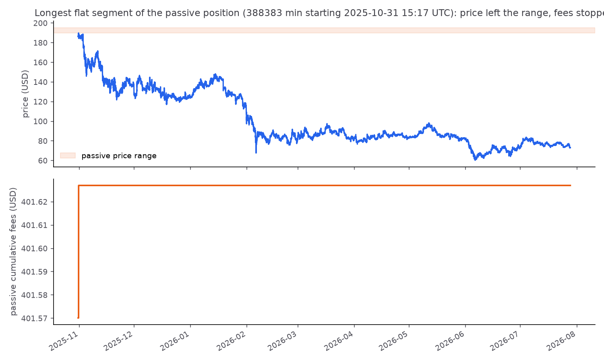

# DLMM Backtest (v1)

Backtesting engine for Meteora-style DLMM liquidity positions on SOL/USDC.
Fetches real 1-minute SOL candles, maps each candle to the DLMM bins its
price range touched, distributes trading fees to those bins, and simulates
how much a user's liquidity position would have earned — comparing a wide
range against a concentrated one.

## Results (14 days of 1-minute data, 2026-07-05 → 2026-07-19)

Same $1,000 deposit in both scenarios; only the range width differs.

| | A: wide | B: concentrated |
|---|---|---|
| Range | 68 bins ($73.14–$83.78) | 51 bins ($77.19–$85.47) |
| Total fees earned | **$121.41** | **$96.70** |
| Fee per day | $8.67 | $6.91 |
| Simple APY | 316.5% | 252.1% |
| Candles earning fees | 100% | 55.2% |


The concentrated position holds a larger share of each bin it occupies
(0.196% vs 0.147%) and out-earned the wide one for the first ~10 days. On
July 16 the price dropped below its lower bound ($77.19) and never
returned, so it earned nothing for the final ~3.3 days and the wide
position overtook it:



This is the tradeoff the backtest quantifies: concentration multiplies
fee income while price stays in range, but income goes to zero the moment
price leaves — which is the price risk a hedging product addresses.

## Repository layout

| File | Purpose |
|---|---|
| `config.py` | All tunable parameters (bin step, pool share, fee rate, TVL, deposit, range width) |
| `bin_math.py` | Bin ↔ price math: `price(i) = (1 + bin_step/10000)^i` and its inverse |
| `fetch_data.py` | Fetches 1-minute SOL OHLCV from Jupiter's chart API into `data/sol_1m.csv` |
| `candle_bins.py` | Maps each candle's [low, high] to the list of bins it touched |
| `fees.py` | Candle fee (`volume × pool_share × fee_rate`) and equal split across touched bins |
| `position.py` | User position: deposit spread equally over a bin range; per-candle user fees |
| `run_backtest.py` | Runs scenarios A and B end to end, prints stats, writes charts to `outputs/` |
| `test_bin_math.py` | Tests for the bin math |
| `data/sol_1m.csv` | The exact dataset the results above were produced from (committed for reproducibility) |

Bin ids use the **raw on-chain price convention** (price in token base
units: SOL 9 decimals, USDC 6), so SOL at ~$76 sits near bin −1287 at
step 20 and ids match on-chain tooling. The CSV stores human (UI) prices;
`candle_bins.py` converts internally.

## How to run

Requires Python 3.12+ with `pandas`, `matplotlib`, `requests`.

```
python run_backtest.py     # the full backtest (uses the committed CSV)
python fetch_data.py       # optional: re-fetch a fresh 14-day window
python test_bin_math.py    # bin math tests
python candle_bins.py      # bin-mapping tests + bin-grid chart
python fees.py             # fee distribution tests + fee-per-bin chart
python position.py         # position tests incl. the task-doc worked example
```

Note: `fetch_data.py` fetches a rolling window ending at run time, so a
re-fetch produces a different dataset than the committed one.

## Verification

- Bin math: floor/boundary behavior asserted, including exact bin-edge prices.
- Data: 20,160 rows, no duplicate timestamps, no gaps, no zero-volume rows.
- Fee conservation: per candle, distributed bin fees sum exactly to the candle
  fee (asserted for all 20,160 candles); per-bin totals sum to total pool fees.
- Scenario A's cumulative curve is monotone and matches the analytic total;
  scenario B is flat exactly when price is outside its range.

## Model assumptions (v1)

- Fees per candle: `volume_usd × POOL_SHARE × FEE_RATE`, split **equally**
  among the bins the candle touched.
- Every bin has fixed TVL (`BIN_TVL`); the user's share of a bin is
  `deposit_per_bin / BIN_TVL` and does not change over time.
- Positions are static: no rebalancing, no inventory/impermanent-loss
  accounting — fee income only.

