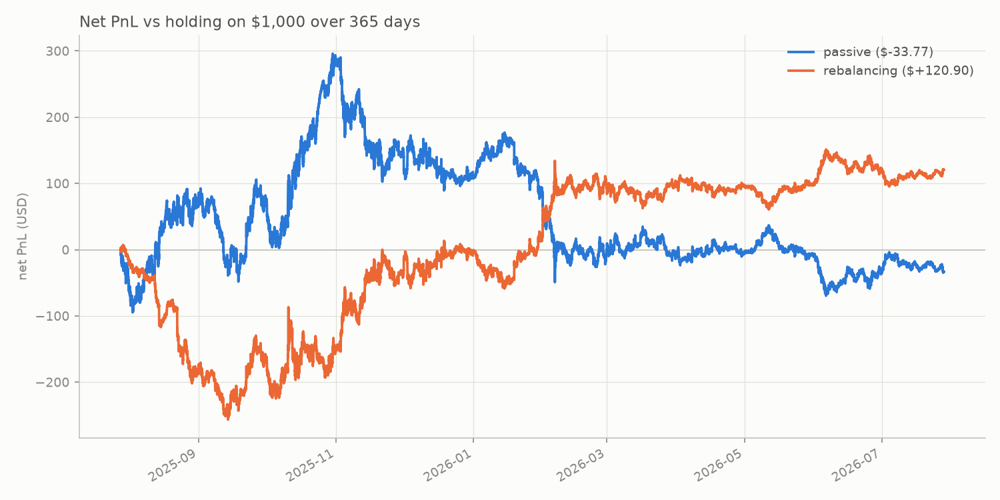
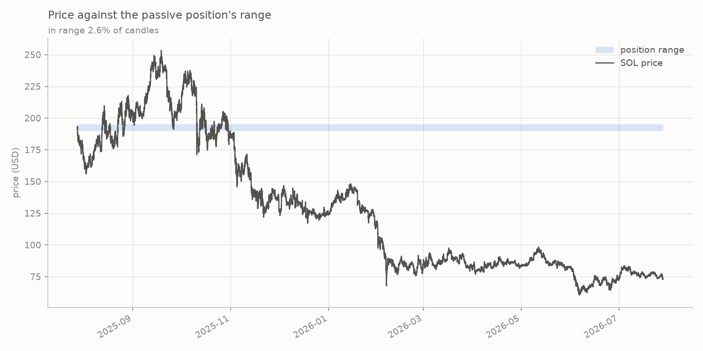
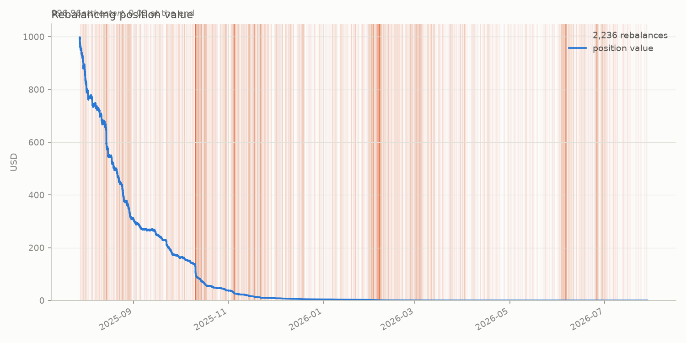
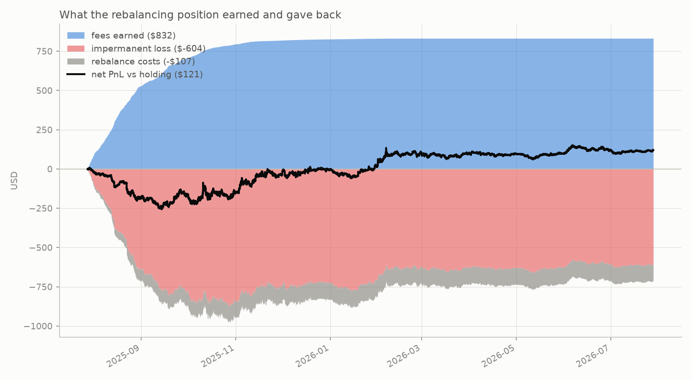

# DLMM Backtest

Backtesting engine for Meteora-style DLMM liquidity positions on SOL/USDC.
Fetches real 1-minute SOL candles, maps each candle to the DLMM bins its
price range touched, distributes trading fees to those bins, tracks the
token inventory of a position as price crosses its bins, and accounts the
result as fee income versus impermanent loss — comparing passive and
rebalancing strategies on the same data.

## Datasets

Two 1-minute SOL datasets, both from Jupiter's chart API. Which one every
module loads is set by `DATA_FILE` in `config.py`.

| dataset | range (UTC) | rows | size |
|---|---|---|---|
| `data/sol_1m_1y.parquet` | 2025-07-28 10:10 → 2026-07-28 10:09 | 525,420 | 25.8 MB — **the default** |
| `data/sol_1m_14d.csv` | 2026-07-05 14:41 → 2026-07-19 14:40 | 20,160 | 2.3 MB |

Both are committed, so a fresh clone (or a deployment) has data without a
fetch step. Switch between them by editing `DATA_FILE`; the results below
are from the year, and the 14-day set is small enough to iterate on
quickly (a few seconds against 54 s on the year, of which the two runs
and all their metrics are 20 s and the thirteen charts are 6 s).

The year ships as Parquet rather than CSV because at this size the format
carries its weight: 0.2 s to load versus ~15 s for the same rows as CSV, and
25.8 MB on disk versus 59.7 MB, with values and dtypes round-tripping
identically. The 57 MB intermediate CSV is gitignored.

To regenerate the year from scratch:

```
python fetch_data.py --days 365 --out data/sol_1m_1y.csv   # ~4 min, 106 API pages
python data_io.py data/sol_1m_1y.csv                       # → data/sol_1m_1y.parquet
```

`fetch_data.py` fetches a rolling window ending at run time, so a re-fetch
will not reproduce either committed file exactly.

### Data quality

Checked with `python verify_data.py data/sol_1m_1y.csv`:

- No duplicate timestamps and no zero/null-volume rows in either dataset.
- The 14-day set has no gaps. The 1-year set is missing **180 minutes across
  15 gaps** (0.03% of the year); the two largest are ~1 hour each, on
  2025-09-25 and 2026-01-23, and look like upstream outages. The engine
  iterates rows rather than assuming contiguous minutes, so these pass
  through as single long candles.
- **Zero candles** in the year have `open == high == low == close`, in any
  month. A padded or forward-filled range would be full of them, so the
  older portion is as genuinely observed as the recent portion — monthly
  price ranges and the daily-close path show real volatility throughout.


## Results (1 year of 1-minute data, 2025-07-28 → 2026-07-28)

Produced from `data/sol_1m_1y.parquet`, the default dataset.

Both strategies put the same $1,000 into the same 69-bin range; the only
difference is whether the range is ever moved. Impermanent loss (IL) is
measured against holding the initial tokens untouched, so net PnL is what
LPing earned *over just holding*.

| strategy | fees | IL | costs | net PnL vs HODL | net APY | rebalances |
|---|---|---|---|---|---|---|
| passive (69 bins, $189.97–$195.29) | $297.50 | −$331.27 | — | **−$33.77** | −3.4% | 0 |
| rebalancing (69 bins) | $831.95 | −$603.67 | $107.38 | **+$120.90** | 12.1% | 2,236 |



SOL fell 62.1% over this year ($192.73 → $73.14), which is the single
fact driving every number below.

### Both strategies lost money

"Net PnL vs holding" is a comparison, not a return, and on a year this
bad the two can point in opposite directions — a strategy can beat
holding and still lose money. Here is what actually happened to the
deposit:

| | passive | rebalancing | just holding |
|---|---|---|---|
| deposit, marked at entry | $996.96 | $996.96 | $996.96 |
| fees collected | $297.50 | $831.95 | — |
| ending position value | $379.80 | $0.02 | $711.07 |
| **total wealth at the end** | **$677.30** | **$831.97** | **$711.07** |
| **absolute return** | **−32.1%** | **−16.5%** | **−28.7%** |
| vs holding | −$33.77 | +$120.90 | — |

Fees are withdrawn as earned rather than compounded back in, so ending
wealth is fees plus whatever the position is still worth. Rebalancing
beat holding by $120.90 and still lost $165 of the $997 put in. The
passive position lost more than holding did.

**The passive strategy lost to holding.** It collected $297.50 of fees
against $331.27 of impermanent loss — the fees fell $33.77 short. Its
gross fee APY of 29.8% looks healthy in isolation; the net APY is −3.4%,
and the gap between those two numbers is exactly what IL ate.

Its range was fixed on the first candle at $189.97–$195.29. Price left it
early and never came back, so it earned on **2.6% of candles** (13,451 of
525,420) and its range saw only 3.4% of the year's pool fees. It spent
331 of 366 days entirely out of range: earning nothing, while still fully
exposed to the price as a 100%-SOL bag riding it down. That is the worst
of both legs, and it is the ordinary outcome for a set-and-forget range.



**Rebalancing did better, and still lost money.** Following the price
down over 2,236 rebalances kept it in range 100% of the time and earned
$831.95 — 2.8× the passive position's fees on the same deposit. That was
enough to beat holding and not enough to be profitable.


### The break-even fee rate

The clearest single number the engine produces: the fee rate at which
fees would have exactly covered IL and costs, given this price path.

| | break-even rate | this run assumed | verdict |
|---|---|---|---|
| passive | **0.0445%** | 0.0400% | 10% below it — loses to holding |
| rebalancing | **0.0342%** | 0.0400% | 17% above it — beats holding |

Both are computed against the same fee model, so the comparison is
internal to it. It is verified by re-running: at the reported rate, net
PnL comes out 0.0000 with IL and costs unchanged.

### The rebalancing position bleeds to nothing

Its value goes $996.96 → $0.02, and fee income decays with it — **94% of
the $831.95 was earned in the first 90 days**:

| month end | 2025-07 | 2025-08 | 2025-09 | 2025-10 | 2025-11 | 2025-12 | 2026-01 | 2026-03 | 2026-07 |
|---|---|---|---|---|---|---|---|---|---|
| position value | $852.04 | $307.29 | $162.20 | $37.45 | $8.67 | $3.97 | $1.80 | $0.16 | $0.02 |
| fees that month | $82.06 | $447.47 | $177.93 | $87.89 | $24.23 | $7.46 | $3.88 | $0.10 | $0.01 |



This is not an accounting bug. On a closed price loop with `REBALANCE_COST`
set to zero, the passive position returns to exactly its starting value
(+0.000000%) while rebalancing loses **0.354% per rebalance** — the
buy-high/sell-low cost of recentring, about 3.5× larger than the 0.1%
explicit cost. Over 2,236 rebalances that compounds the position away.
Rebalancing converts impermanent loss into *permanent* loss, and the fee
income has to outrun it.

So the annualized figure is not repeatable: by month five the position is
worth $8 and earns nothing. Realizing anything like it again means
redepositing, which is a different (and untested) strategy.

It also explains the shape of the rebalancing line after early 2026: it
keeps drifting up while the position earns nothing. With the position at
roughly zero, net PnL is `fees − HODL`, so every further fall in SOL
*raises* it. That late rise is the baseline sinking, not the strategy
working.



**Cost sensitivity.** The verdict does not survive a higher trading cost:

| `REBALANCE_COST` | 0% | 0.1% | 0.5% |
|---|---|---|---|
| net PnL vs HODL | +$227.83 | +$120.90 | **−$144.60** |

At 0.5% the 2,236 rebalances cost $375.03 and rebalancing loses to
holding as well. The strategy's edge is a bet that recentring stays
cheap.

The engine thus measures the two legs any range-management or hedging
approach is judged against: the fee income a position keeps, and the
price-exposure cost (IL) that must be managed away. On this year, moving
the range earned more fees than it cost — and neither strategy earned
enough to make LPing through a 62% drawdown profitable.

## Repository layout

| File | Purpose |
|---|---|
| `config.py` | All tunable parameters (bin step, pool share, fee rate, TVL, deposit, position width and the `MAX_BINS` ceiling, fee split mode, rebalance cost) |
| `bin_math.py` | Bin ↔ price math: `price(i) = (1 + bin_step/10000)^i` and its inverse |
| `fetch_data.py` | Fetches 1-minute SOL OHLCV from Jupiter's chart API (`--days`, `--out`) |
| `data_io.py` | Loads the configured dataset (CSV or Parquet); converts CSV → Parquet |
| `verify_data.py` | Data-quality check: monthly price ranges, flat-candle counts, daily-close chart |
| `candle_bins.py` | Maps each candle's [low, high] to the list of bins it touched |
| `fees.py` | Candle fee (`volume × pool_share × fee_rate`), split equally or weighted by price-range overlap |
| `position.py` | User position: deposit spread equally over a bin range; per-candle user fees |
| `inventory.py` | Token inventory per bin (USDC below the price, SOL above), flips as price crosses bins, position value |
| `pnl.py` | HODL baseline, impermanent loss, net PnL (fees + IL) |
| `strategies.py` | Rebalancing strategy: close-outside-range trigger, recenter, cost on the value traded |
| `backtest.py` | One run as data: `run()` returns `{params, series, events, metrics}` and prints nothing |
| `metrics.py` | Every reported number, computed from a run's series (no formatting) |
| `report.py` | Formats a run for a terminal, ending in a plain-language paragraph (no computing) |
| `charts.py` | Every chart, each function taking a run and returning a figure (no file writing) |
| `run_backtest.py` | Runs both strategies, prints the reports, saves the run, writes the charts to `outputs/` |
| `results/store.py` | Appends every run to `results/runs.csv`, one row per strategy, sharing an execution id |
| `test_bin_math.py` | Tests for the bin math |
| `data/sol_1m_1y.parquet` | The exact dataset the results above were produced from (committed for reproducibility) |

Bin ids use the **raw on-chain price convention** (price in token base
units: SOL 9 decimals, USDC 6), so SOL at ~$76 sits near bin −6444 at
step 4 and ids match on-chain tooling. The data files store human (UI)
prices; `candle_bins.py` converts internally.

Positions are a fixed `POSITION_BINS`-wide range (69, Meteora's default),
and `make_position` rejects anything wider than `MAX_BINS`. Every position
in the engine — including the ones a rebalance opens — is built there, so
there is no path around the ceiling.

Computing, formatting and drawing are kept apart. `backtest.run()` returns
a result dict and prints nothing; `params` and `metrics` inside it are flat
and JSON-serialisable, and `series` and `events` are what the charts
consume. Anything other than a terminal — a web front end, a results store,
a parameter sweep — calls `run()` directly and skips `run_backtest.py`.

## How to run

Requires Python 3.12+ with `pandas`, `matplotlib`, `requests`, and `pyarrow`
(the last only for the Parquet path).

```
python run_backtest.py     # the full backtest (uses config.DATA_FILE)
python run_backtest.py passive   # just one strategy
python report.py           # the same numbers, printed without writing charts
python fetch_data.py       # optional: re-fetch a fresh 14-day window
python verify_data.py      # data-quality check on a fetched file
python test_bin_math.py    # bin math tests
python candle_bins.py      # bin-mapping tests + bin-grid chart
python fees.py             # fee distribution tests + fee-per-bin chart
python position.py         # position tests incl. the reference worked example
python inventory.py        # inventory checks on synthetic price paths
python pnl.py              # IL checks (round trip closes to 0; one-way matches the hand formula)
python strategies.py       # rebalancing checks (equivalence, value neutrality, trade direction)
```

## Verification

- Bin math: floor/boundary behavior asserted, including exact bin-edge prices.
- Data: 20,160 rows, no duplicate timestamps, no gaps, no zero-volume rows
  (14-day set; see Data quality above for the 1-year set).
- Fee conservation: per candle, distributed bin fees sum exactly to the candle
  fee (asserted for every candle in the dataset); per-bin totals sum to total
  pool fees.
- The passive position's cumulative curve is monotone and matches the analytic
  total — with equal shares across the range, its fees must come to exactly
  `share × (fees landing in range)` — and is flat exactly when price is
  outside the range.
- A position wider than `MAX_BINS` is rejected by `make_position`.
- Inventory: a price round trip restores every bin's exact tokens and value;
  value is constant when no bin is crossed and all bins hold USDC.
- IL: ≤ 0 at every candle (an LP never beats holding without fees); closes to
  exactly 0 on a round trip; a one-way move matches the closed-form
  `sol_sold × (final price − average sale price)`.
- Rebalancing: with no range exit the strategy equals the passive position
  exactly; with zero cost, value is continuous through every rebalance
  (the conversion is value-neutral by construction); a rise out of range
  buys SOL and a fall sells it, asserted on synthetic paths.
- The recentring bleed is isolated rather than inferred: 30 closed price
  cycles at zero cost drive 60 rebalances, every cycle costs an identical
  −0.7059%, and the geometric prediction matches to 1e-6 — −0.3536% per
  rebalance, with nothing else in the model able to account for it.
- The break-even fee rate is checked by re-running at it, not by
  re-deriving its own formula: net PnL comes out 0.0000 for both
  strategies, with IL and costs unchanged.
- Charts never change a number: drawing is decimated to ~12k points
  keeping each series' envelope, while every metric is computed on the
  full series.

## Model assumptions

- Fees per candle: `volume_usd × POOL_SHARE × FEE_RATE`, split among the
  bins the candle touched — weighted by each bin's share of the candle's
  price range by default, or equally (`FEE_DISTRIBUTION`). On this
  dataset the two modes differ by cents: only candles straddling a
  range edge are affected.
- Every bin has fixed TVL (`BIN_TVL = 13,500`); the user's share of a bin
  is `deposit_per_bin / BIN_TVL`. That figure comes from the tracked pool:
  about $723k sat inside a ±1% band, which at bin step 4 is 50 bins, so
  $14.46k per bin there; a 69-bin position reaches past that band into
  thinner liquidity, and interpolating out to 69 bins gives $13.44k. Every
  fee number scales inversely with it — the depth of the pool you join is
  the single biggest lever on all of the results above. TVL is also held
  constant: in reality it moves, and other LPs would crowd into a range
  that is earning well.
- Inventory is driven by candle **closes** only: bins at or below the
  active bin hold USDC, bins above hold SOL, and a bin that changes side
  converts its whole holding at its own price. Intra-candle paths are
  ignored.
- IL is an opportunity cost versus holding the initial tokens, not a
  direct loss; it closes again if price returns to entry.
- Rebalancing triggers when a candle closes outside the range; the
  position reopens at the same width centered on the current bin, with
  `REBALANCE_COST` charged on the value that changes hands in the
  conversion (a stand-in for swap fees, slippage and gas).
