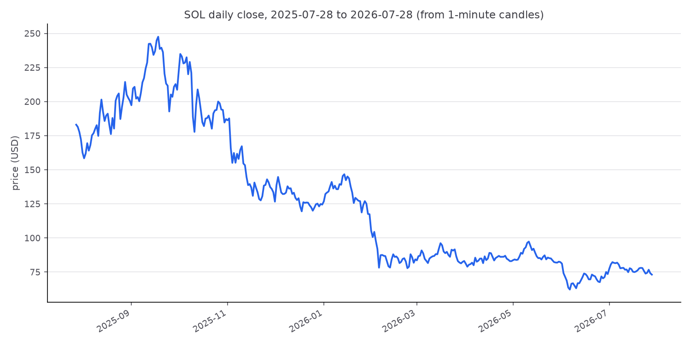

# DLMM Backtest

Backtesting engine for Meteora-style DLMM liquidity positions on SOL/USDC.
Fetches real 1-minute SOL candles, maps each candle to the DLMM bins its
price range touched, distributes trading fees to those bins, tracks the
token inventory of a position as price crosses its bins, and accounts the
result as fee income versus impermanent loss — comparing passive and
rebalancing strategies on the same data.

## Datasets

Two 1-minute SOL datasets, both from Jupiter's chart API. Which one every
module loads is set by `DATA_FILE` in `config.py`.

| dataset | range (UTC) | rows | size |
|---|---|---|---|
| `data/sol_1m_1y.parquet` | 2025-07-28 10:10 → 2026-07-28 10:09 | 525,420 | 25.8 MB — **the default** |
| `data/sol_1m_14d.csv` | 2026-07-05 14:41 → 2026-07-19 14:40 | 20,160 | 2.3 MB |

Both are committed, so a fresh clone (or a deployment) has data without a
fetch step. Switch between them by editing `DATA_FILE`; the 14-day set is
the one the fortnight results below were produced from, and is small enough
to iterate on quickly.

The year ships as Parquet rather than CSV because at this size the format
carries its weight: 0.2 s to load versus ~15 s for the same rows as CSV, and
25.8 MB on disk versus 59.7 MB, with values and dtypes round-tripping
identically. The 57 MB intermediate CSV is gitignored.

To regenerate the year from scratch:

```
python fetch_data.py --days 365 --out data/sol_1m_1y.csv   # ~4 min, 106 API pages
python data_io.py data/sol_1m_1y.csv                       # → data/sol_1m_1y.parquet
```

`fetch_data.py` fetches a rolling window ending at run time, so a re-fetch
will not reproduce either committed file exactly.

### Data quality

Checked with `python verify_data.py data/sol_1m_1y.csv`:

- No duplicate timestamps and no zero/null-volume rows in either dataset.
- The 14-day set has no gaps. The 1-year set is missing **180 minutes across
  15 gaps** (0.03% of the year); the two largest are ~1 hour each, on
  2025-09-25 and 2026-01-23, and look like upstream outages. The engine
  iterates rows rather than assuming contiguous minutes, so these pass
  through as single long candles.
- **Zero candles** in the year have `open == high == low == close`, in any
  month. A padded or forward-filled range would be full of them, so the
  older portion is as genuinely observed as the recent portion — monthly
  price ranges and the daily-close path show real volatility throughout.



## Results (14 days of 1-minute data, 2026-07-05 → 2026-07-19)

Produced from `data/sol_1m_14d.csv`.

Same $1,000 deposit in all three strategies. Impermanent loss (IL) is
measured against holding the initial tokens untouched, so net PnL is what
LPing earned *over just holding*.

| strategy | fees | IL | costs | net PnL | net APY | rebalances |
|---|---|---|---|---|---|---|
| A: passive wide (68 bins, $73.14–$83.78) | $121.41 | −$14.16 | — | **+$107.25** | 279.6% | 0 |
| B: passive concentrated (51 bins, $77.19–$85.47) | $96.73 | −$18.32 | — | **+$78.41** | 204.4% | 0 |
| C: rebalancing concentrated (51 bins) | $157.47 | −$13.18 | $0.49 | **+$143.80** | 374.9% | 1 |


**Fee side.** The concentrated position holds a larger share of each bin
it occupies (0.196% vs 0.147%) and out-earned the wide one for the first
~10 days. On July 16 the price dropped below its lower bound ($77.19) and
never returned, so it earned nothing for the final ~3.3 days and the wide
position overtook it:


**Fees vs impermanent loss.** Fees covered IL in both passive scenarios,
but concentration amplifies both sides with the same lever: fewer bins →
more dollars per bin → a bigger share of each bin's fees *and* more
dollars converted on every bin crossing. B gave up ~19¢ of IL per fee
dollar versus A's ~12¢, and being out of range combines the worst of
both worlds — zero fee income while fully exposed to the price (the
position is 100% SOL below its range):


**Rebalancing.** Strategy C starts identical to B; when a candle closes
outside the range it closes the position and reopens the same width
centered on the current bin, paying 0.1% on the value traded in the
conversion. On this dataset that happened exactly once (July 8: sold
6.36 SOL at $77.19, cost $0.49) and the new range held for the remaining
11 days — so C kept B's concentrated fee share while staying in range
almost always, and beat both passive strategies. The verdict is robust to
the cost assumption here (net +$144.34 / +$143.80 / +$141.62 at 0% /
0.1% / 0.5%) but only because a single rebalance occurred: a price that
oscillates around a range edge triggers repeated rebalances, each of
which pays the cost *and* realizes the loss accumulated on the way out
(selling low after a fall, re-buying high after a rise). Rebalancing
converts impermanent loss into permanent loss; this fortnight was simply
a favorable path for it.

The engine thus measures the two legs any range-management or hedging
approach is judged against: the fee income a position keeps, and the
price-exposure cost (IL) that must be managed away.

## Repository layout

| File | Purpose |
|---|---|
| `config.py` | All tunable parameters (bin step, pool share, fee rate, TVL, deposit, range width, fee split mode, rebalance cost) |
| `bin_math.py` | Bin ↔ price math: `price(i) = (1 + bin_step/10000)^i` and its inverse |
| `fetch_data.py` | Fetches 1-minute SOL OHLCV from Jupiter's chart API (`--days`, `--out`) |
| `data_io.py` | Loads the configured dataset (CSV or Parquet); converts CSV → Parquet |
| `verify_data.py` | Data-quality check: monthly price ranges, flat-candle counts, daily-close chart |
| `candle_bins.py` | Maps each candle's [low, high] to the list of bins it touched |
| `fees.py` | Candle fee (`volume × pool_share × fee_rate`), split equally or weighted by price-range overlap |
| `position.py` | User position: deposit spread equally over a bin range; per-candle user fees |
| `inventory.py` | Token inventory per bin (USDC below the price, SOL above), flips as price crosses bins, position value |
| `pnl.py` | HODL baseline, impermanent loss, net PnL (fees + IL) |
| `strategies.py` | Rebalancing strategy: close-outside-range trigger, recenter, cost on the value traded |
| `run_backtest.py` | Runs all three strategies end to end, prints the tables, writes charts to `outputs/` |
| `test_bin_math.py` | Tests for the bin math |
| `data/sol_1m_14d.csv` | The exact dataset the results above were produced from (committed for reproducibility) |

Bin ids use the **raw on-chain price convention** (price in token base
units: SOL 9 decimals, USDC 6), so SOL at ~$76 sits near bin −1287 at
step 20 and ids match on-chain tooling. The data files store human (UI)
prices; `candle_bins.py` converts internally.

## How to run

Requires Python 3.12+ with `pandas`, `matplotlib`, `requests`, and `pyarrow`
(the last only for the Parquet path).

```
python run_backtest.py     # the full backtest (uses config.DATA_FILE)
python fetch_data.py       # optional: re-fetch a fresh 14-day window
python verify_data.py      # data-quality check on a fetched file
python test_bin_math.py    # bin math tests
python candle_bins.py      # bin-mapping tests + bin-grid chart
python fees.py             # fee distribution tests + fee-per-bin chart
python position.py         # position tests incl. the reference worked example
python inventory.py        # inventory checks on synthetic price paths
python pnl.py              # IL checks (round trip closes to 0; one-way matches the hand formula)
python strategies.py       # rebalancing checks (equivalence, value neutrality, trade direction)
```

## Verification

- Bin math: floor/boundary behavior asserted, including exact bin-edge prices.
- Data: 20,160 rows, no duplicate timestamps, no gaps, no zero-volume rows
  (14-day set; see Data quality above for the 1-year set).
- Fee conservation: per candle, distributed bin fees sum exactly to the candle
  fee (asserted for all 20,160 candles); per-bin totals sum to total pool fees.
- Scenario A's cumulative curve is monotone and matches the analytic total;
  scenario B is flat exactly when price is outside its range.
- Inventory: a price round trip restores every bin's exact tokens and value;
  value is constant when no bin is crossed and all bins hold USDC.
- IL: ≤ 0 at every candle (an LP never beats holding without fees); closes to
  exactly 0 on a round trip; a one-way move matches the closed-form
  `sol_sold × (final price − average sale price)`.
- Rebalancing: with no range exit the strategy equals the passive position
  exactly; with zero cost, value is continuous through every rebalance
  (the conversion is value-neutral by construction); a rise out of range
  buys SOL and a fall sells it, asserted on synthetic paths.

## Model assumptions

- Fees per candle: `volume_usd × POOL_SHARE × FEE_RATE`, split among the
  bins the candle touched — weighted by each bin's share of the candle's
  price range by default, or equally (`FEE_DISTRIBUTION`). On this
  dataset the two modes differ by cents: only candles straddling a
  range edge are affected.
- Every bin has fixed TVL (`BIN_TVL`); the user's share of a bin is
  `deposit_per_bin / BIN_TVL`.
- Inventory is driven by candle **closes** only: bins at or below the
  active bin hold USDC, bins above hold SOL, and a bin that changes side
  converts its whole holding at its own price. Intra-candle paths are
  ignored.
- IL is an opportunity cost versus holding the initial tokens, not a
  direct loss; it closes again if price returns to entry.
- Rebalancing triggers when a candle closes outside the range; the
  position reopens at the same width centered on the current bin, with
  `REBALANCE_COST` charged on the value that changes hands in the
  conversion (a stand-in for swap fees, slippage and gas).
