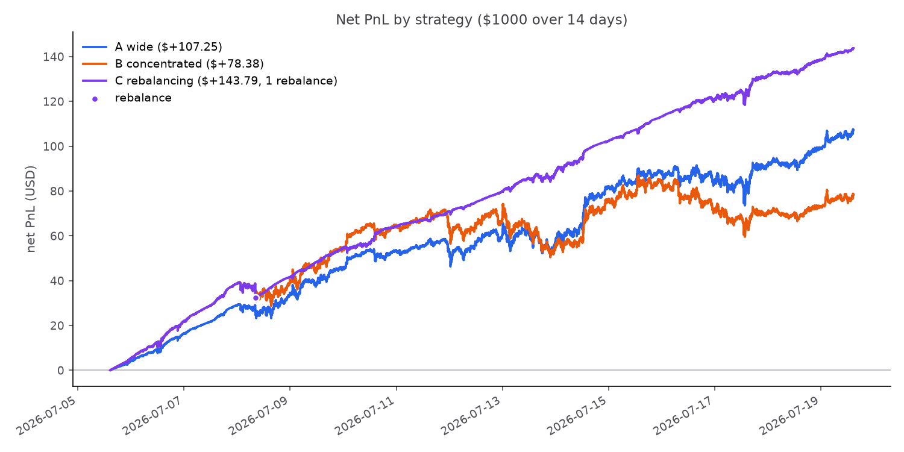
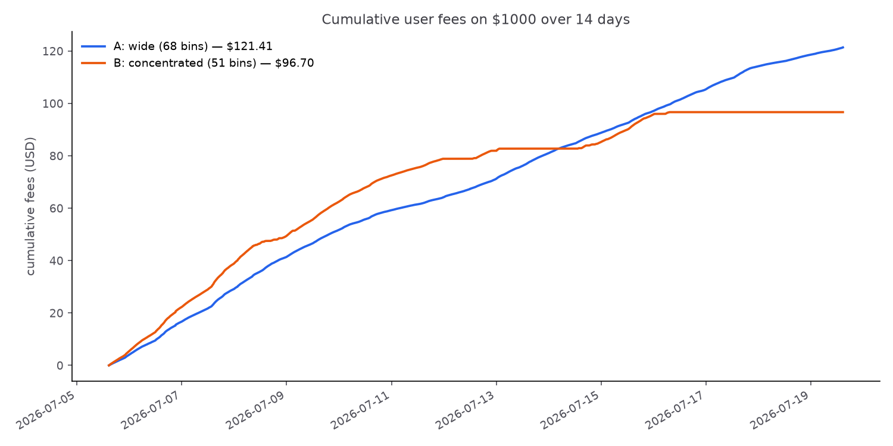
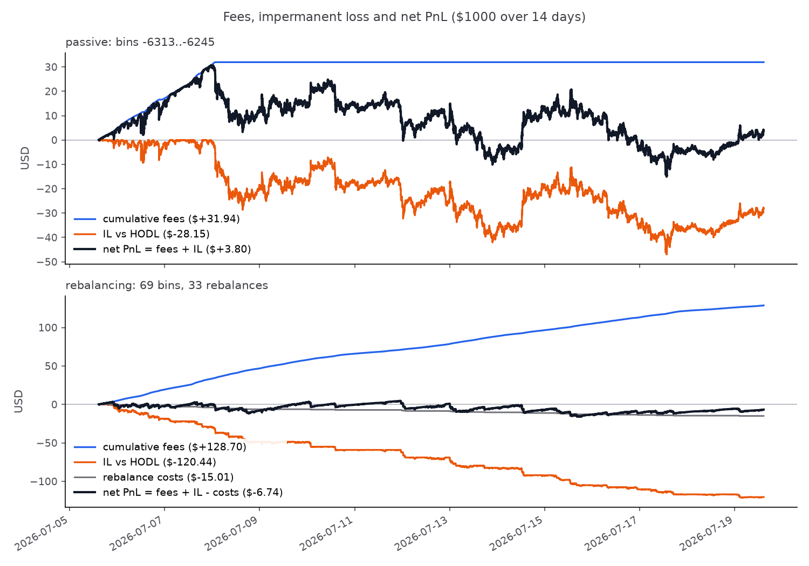

# DLMM Backtest

Backtesting engine for Meteora-style DLMM liquidity positions on SOL/USDC.
Fetches real 1-minute SOL candles, maps each candle to the DLMM bins its
price range touched, distributes trading fees to those bins, tracks the
token inventory of a position as price crosses its bins, and accounts the
result as fee income versus impermanent loss — comparing passive and
rebalancing strategies on the same data.

## Results (14 days of 1-minute data, 2026-07-05 → 2026-07-19)

Same $1,000 deposit in all three strategies. Impermanent loss (IL) is
measured against holding the initial tokens untouched, so net PnL is what
LPing earned *over just holding*.

| strategy | fees | IL | costs | net PnL | net APY | rebalances |
|---|---|---|---|---|---|---|
| A: passive wide (68 bins, $73.14–$83.78) | $121.41 | −$14.16 | — | **+$107.25** | 279.6% | 0 |
| B: passive concentrated (51 bins, $77.19–$85.47) | $96.70 | −$18.32 | — | **+$78.38** | 204.4% | 0 |
| C: rebalancing concentrated (51 bins) | $157.46 | −$13.18 | $0.49 | **+$143.79** | 374.9% | 1 |



**Fee side.** The concentrated position holds a larger share of each bin
it occupies (0.196% vs 0.147%) and out-earned the wide one for the first
~10 days. On July 16 the price dropped below its lower bound ($77.19) and
never returned, so it earned nothing for the final ~3.3 days and the wide
position overtook it:



**Fees vs impermanent loss.** Fees covered IL in both passive scenarios,
but concentration amplifies both sides with the same lever: fewer bins →
more dollars per bin → a bigger share of each bin's fees *and* more
dollars converted on every bin crossing. B gave up ~19¢ of IL per fee
dollar versus A's ~12¢, and being out of range combines the worst of
both worlds — zero fee income while fully exposed to the price (the
position is 100% SOL below its range):



**Rebalancing.** Strategy C starts identical to B; when a candle closes
outside the range it closes the position and reopens the same width
centered on the current bin, paying 0.1% on the value traded in the
conversion. On this dataset that happened exactly once (July 8: sold
6.36 SOL at $77.19, cost $0.49) and the new range held for the remaining
11 days — so C kept B's concentrated fee share while staying in range
almost always, and beat both passive strategies. The verdict is robust to
the cost assumption here (net +$144.33 / +$143.79 / +$141.61 at 0% /
0.1% / 0.5%) but only because a single rebalance occurred: a price that
oscillates around a range edge triggers repeated rebalances, each of
which pays the cost *and* realizes the loss accumulated on the way out
(selling low after a fall, re-buying high after a rise). Rebalancing
converts impermanent loss into permanent loss; this fortnight was simply
a favorable path for it.

The engine thus measures the two legs any range-management or hedging
approach is judged against: the fee income a position keeps, and the
price-exposure cost (IL) that must be managed away.

## Repository layout

| File | Purpose |
|---|---|
| `config.py` | All tunable parameters (bin step, pool share, fee rate, TVL, deposit, range width, fee split mode, rebalance cost) |
| `bin_math.py` | Bin ↔ price math: `price(i) = (1 + bin_step/10000)^i` and its inverse |
| `fetch_data.py` | Fetches 1-minute SOL OHLCV from Jupiter's chart API into `data/sol_1m.csv` |
| `candle_bins.py` | Maps each candle's [low, high] to the list of bins it touched |
| `fees.py` | Candle fee (`volume × pool_share × fee_rate`), split equally or weighted by price-range overlap |
| `position.py` | User position: deposit spread equally over a bin range; per-candle user fees |
| `inventory.py` | Token inventory per bin (USDC below the price, SOL above), flips as price crosses bins, position value |
| `pnl.py` | HODL baseline, impermanent loss, net PnL (fees + IL) |
| `strategies.py` | Rebalancing strategy: close-outside-range trigger, recenter, cost on the value traded |
| `run_backtest.py` | Runs all three strategies end to end, prints the tables, writes charts to `outputs/` |
| `test_bin_math.py` | Tests for the bin math |
| `data/sol_1m.csv` | The exact dataset the results above were produced from (committed for reproducibility) |

Bin ids use the **raw on-chain price convention** (price in token base
units: SOL 9 decimals, USDC 6), so SOL at ~$76 sits near bin −1287 at
step 20 and ids match on-chain tooling. The CSV stores human (UI) prices;
`candle_bins.py` converts internally.

## How to run

Requires Python 3.12+ with `pandas`, `matplotlib`, `requests`.

```
python run_backtest.py     # the full backtest (uses the committed CSV)
python fetch_data.py       # optional: re-fetch a fresh 14-day window
python test_bin_math.py    # bin math tests
python candle_bins.py      # bin-mapping tests + bin-grid chart
python fees.py             # fee distribution tests + fee-per-bin chart
python position.py         # position tests incl. the reference worked example
python inventory.py        # inventory checks on synthetic price paths
python pnl.py              # IL checks (round trip closes to 0; one-way matches the hand formula)
python strategies.py       # rebalancing checks (equivalence, value neutrality, trade direction)
```

Note: `fetch_data.py` fetches a rolling window ending at run time, so a
re-fetch produces a different dataset than the committed one.

## Verification

- Bin math: floor/boundary behavior asserted, including exact bin-edge prices.
- Data: 20,160 rows, no duplicate timestamps, no gaps, no zero-volume rows.
- Fee conservation: per candle, distributed bin fees sum exactly to the candle
  fee (asserted for all 20,160 candles); per-bin totals sum to total pool fees.
- Scenario A's cumulative curve is monotone and matches the analytic total;
  scenario B is flat exactly when price is outside its range.
- Inventory: a price round trip restores every bin's exact tokens and value;
  value is constant when no bin is crossed and all bins hold USDC.
- IL: ≤ 0 at every candle (an LP never beats holding without fees); closes to
  exactly 0 on a round trip; a one-way move matches the closed-form
  `sol_sold × (final price − average sale price)`.
- Rebalancing: with no range exit the strategy equals the passive position
  exactly; with zero cost, value is continuous through every rebalance
  (the conversion is value-neutral by construction); a rise out of range
  buys SOL and a fall sells it, asserted on synthetic paths.

## Model assumptions

- Fees per candle: `volume_usd × POOL_SHARE × FEE_RATE`, split among the
  bins the candle touched — equally by default, or weighted by each bin's
  share of the candle's price range (`FEE_DISTRIBUTION`).
- Every bin has fixed TVL (`BIN_TVL`); the user's share of a bin is
  `deposit_per_bin / BIN_TVL`.
- Inventory is driven by candle **closes** only: bins at or below the
  active bin hold USDC, bins above hold SOL, and a bin that changes side
  converts its whole holding at its own price. Intra-candle paths are
  ignored.
- IL is an opportunity cost versus holding the initial tokens, not a
  direct loss; it closes again if price returns to entry.
- Rebalancing triggers when a candle closes outside the range; the
  position reopens at the same width centered on the current bin, with
  `REBALANCE_COST` charged on the value that changes hands in the
  conversion (a stand-in for swap fees, slippage and gas).
